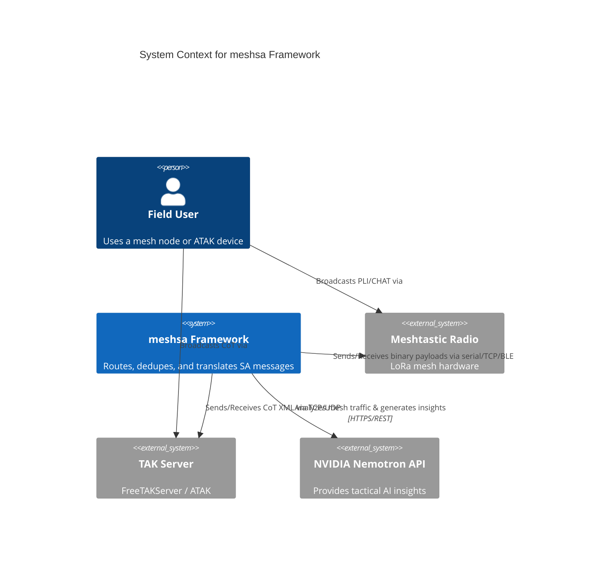

# Architecture

This document describes the structure and design of the `meshsa` framework that
ships as `packages/meshsa`. For project layout, see [CONTRIBUTING.md](../CONTRIBUTING.md).

## C4 Architecture

## Goals

1. **Transport-agnostic.** Add new radios, IP transports, or TAK servers without
   touching core code.
2. **Wire-compatible.** Every framed message carries a `schema_version`; nodes
   running different builds can interoperate within the supported window.
3. **Testable without hardware.** All I/O sits behind structural-typed
   `Protocol`s; the test suite uses fakes for clocks, IDs, transports, and
   the Meshtastic / TAK glue.
4. **Zero hard-coded operational defaults.** Ports, intervals, callsigns, cache
   sizes, backoff curves are all Pydantic config fields.

## Module map

| Module                          | Purpose                                                              |
|---------------------------------|----------------------------------------------------------------------|
| `meshsa.version`                | `SCHEMA_VERSION`, `MIN_COMPATIBLE_SCHEMA`, `is_compatible()`         |
| `meshsa.errors`                 | Exception hierarchy rooted at `MeshSAError`                          |
| `meshsa.protocols`              | `Transport`, `Codec`, `Clock`, `IdFactory` Protocols + defaults      |
| `meshsa.models`                 | `Position`, `NodeInfo`, `Envelope`, `PliPayload`, `ChatPayload`      |
| `meshsa.config`                 | `NodeConfig`, `MeshConfig`, `RouterConfig`, `TransportConfig`        |
| `meshsa.registry`               | Generic `Registry[T]`; `transport_registry`, `codec_registry`        |
| `meshsa.codec`                  | `JsonCodec` (Envelope <-> bytes)                                     |
| `meshsa.compact`                | `CompactCodec` (LoRa-sized binary, ~40 B)                            |
| `meshsa.cot`                    | `CotCodec` (ATAK / TAK Cursor-on-Target XML)                         |
| `meshsa.router`                 | Async broker: dedupe, bridge, per-transport codec selection         |
| `meshsa.inference`              | AI integration via `NemotronClient` and `InferenceService`           |
| `meshsa.node`                   | `Node` dataclass + `build_node(config)` factory                      |
| `meshsa.transports.base`        | `AbstractTransport` (async inbox, `stream()`, `send()`)              |
| `meshsa.transports.loopback`    | `LoopbackBus`, `LoopbackTransport`, `NullTransport`                  |
| `meshsa.transports.meshtastic_radio` | Real Meshtastic (USB / TCP / BLE) with reconnect supervisor    |
| `meshsa.transports.tak`         | `TakTcpTransport`, `TakMulticastTransport` for FreeTAKServer / ATAK  |
| `meshsa.examples.base_node`     | Field-runnable bridge (`meshsa-base` console script)                 |

## Patterns

### Dependency injection via `Protocol`
Anything I/O-shaped is a `typing.Protocol`. The router and node accept those types,
not concrete classes. This is what lets the test suite drive a 98-test, 100%
coverage run without hardware.

### Open/closed registries
`transport_registry` and `codec_registry` are generic `Registry[T]` instances.
Modules self-register at import time. Adding a new transport is "config + factory,
no core edits."

### Per-transport codec selection
The router's `_codec_for(transport)` map lets a single bridge run JSON over LoRa,
CoT over TAK TCP, and compact binary over Meshtastic simultaneously. Bridging
re-encodes when forwarding between transports of different codecs.

### Schema versioning
Every `Envelope` carries `schema_version: int`. Codecs compare against
`SCHEMA_VERSION` / `MIN_COMPATIBLE_SCHEMA` and raise `IncompatibleSchemaError`,
which the router catches and logs (the frame is dropped, not crashed).

### Forward-compatible config loading
`build_node()` skips unknown transport `type` entries instead of raising. This lets
older builds load configs that contain transports they do not yet understand.

## Compatibility policy

| Change                                  | Action                                      |
|-----------------------------------------|---------------------------------------------|
| Add an optional Envelope field          | None (Pydantic defaults handle it)          |
| Add a new payload kind                  | None (unknown kinds drop, no schema bump)   |
| Add a new transport / codec             | None (registry self-registration)           |
| Change Envelope shape (rename / remove) | Bump `SCHEMA_VERSION`, document in CHANGELOG|
| Drop support for an older build         | Raise `MIN_COMPATIBLE_SCHEMA`, document     |

See [docs/AUDIT_REPORT.md](AUDIT_REPORT.md) for known gaps and the prioritized
backlog.
