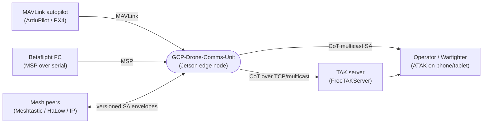
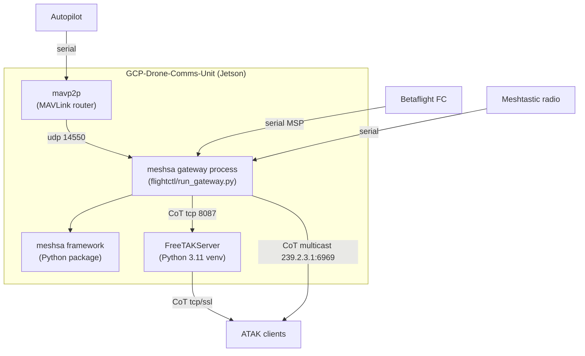
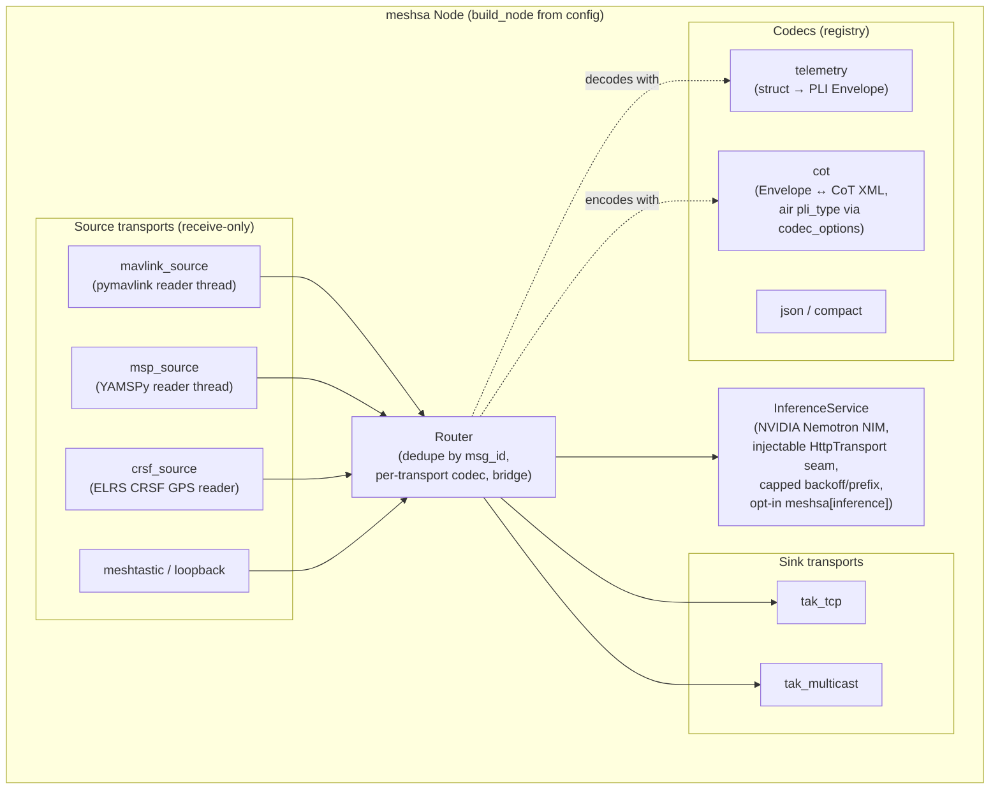
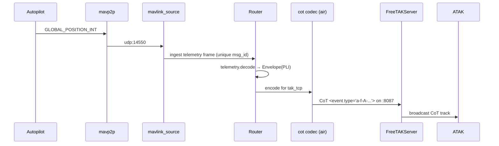
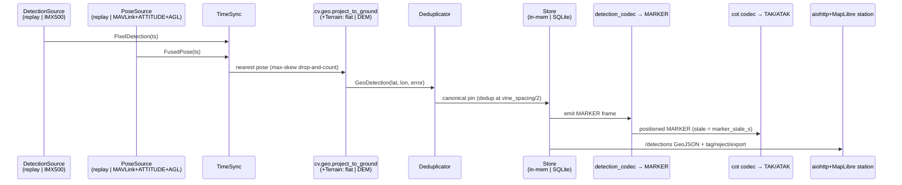

# C4 Architecture — GCP-Drone-Comms-Unit

C4 model (Context → Container → Component) for the drone-comms / mesh-SA → TAK bridge.
Diagrams are Mermaid so they render on GitHub. See [ARCHITECTURE.md](ARCHITECTURE.md) for
the framework's design rationale, [CHARTER.md](CHARTER.md) for the stable scope/invariants,
and [ROADMAP.md](ROADMAP.md) for the long-term milestone trajectory.

## Level 1 — System Context

The unit ingests drone/FC telemetry and mesh SA, and emits **CoT** so ATAK clients see
positions as tracks. ATAK itself runs on phones/tablets, not on the unit.

## Level 2 — Container

Containers are independent processes (systemd units): the **gateway** (meshsa node from a
JSON config), **FreeTAKServer**, and the **mavp2p** MAVLink router. Each scales/fails
independently; the gateway is the only one that must understand both sides.

## Level 3 — Component (inside the meshsa gateway)

Key contracts (Python `Protocol`s, dependency-injected so everything tests without
hardware): `Transport` (start/stop/send/stream bytes), `Codec` (encode/decode `Envelope`),
`Clock`, `IdFactory`. New mediums plug in via `transport_registry` / `codec_registry` with
**no core edits**. The stateful MAVLink/MSP parse lives in each source transport's reader
thread; the `telemetry` codec is a stateless per-frame map. Drone tracks reuse the `PLI`
kind with an **air** `pli_type` configured per-transport — no `schema_version` bump.

**Adjunct services (opt-in, out of the hot path):** the node exposes an optional aiohttp
**health/metrics listener** (`/healthz`, `/metrics` in Prometheus or JSON); the `meshsa.fpv`
ground-side subsystem runs its own CRSF link-health monitor, flight logger, and camera
capture writer; a **read-only** `meshsa.llm` situational-awareness assistant answers
operator questions over live telemetry (via mavlink2rest on `:8088`) and TAK tracks; and an
optional **`meshsa.inference` AI bridge** subscribes to mesh traffic, sends messages to the
**NVIDIA Nemotron NIM API** for tactical analysis, and broadcasts AI insight summaries
(configurable prefix via `MESHSA_INFERENCE_INSIGHT_PREFIX`) back to the mesh. The HTTP
boundary is an injectable **`HttpTransport`** `Protocol` (`HttpResponse` + the default
socket-backed `AiohttpTransport`, which owns the reused `asyncio.Lock`-guarded session), so
the `NemotronClient` retry/backoff/parse logic stays pure and is tested with a fake — no
sockets. Backoff is exponential and **capped** (`backoff_base`/`backoff_max_s`); non-429 4xx
fail fast while 429/5xx retry; failures surface as `InferenceTransportError`/
`InferenceHttpError` (both `MeshSAError`). Lazy `aiohttp` import — install with
`meshsa[inference]`; all config via `MESHSA_INFERENCE_*` env vars. The **Router** wraps
subscriber callbacks in `try/except` so a failing handler never crashes the message pump.
All command-path errors inherit `MeshSAError` for unified error handling. These issue no
vehicle commands — see [CHARTER.md](CHARTER.md) §3 and the ratified, M2-gated
supervised-commanding initiative in [ROADMAP.md](ROADMAP.md).

## Data flow (one drone fix)

## Vineyard scouting (`meshsa.scout`)

An offline, hardware-free subpackage that turns a mapping survey into a georeferenced,
deduplicated anomaly map. It **reuses** the georeferencing (`cv.geo`) and the
detection→MARKER→CoT path (so pins render on the same TAK map as air tracks), and adds pose/AGL
fusion, DEM terrain, spatial dedup, a per-block store, survey/mission export, and a thin
operator station. Ships behind `Protocol` seams so the whole pipeline runs against a synthetic
replay harness with no radios/GPS/camera. Config is `ScoutConfig` (`MESHSA_SCOUT_*`); CLI is
`meshsa-scout`.

Mission output (`meshsa-scout gen-mission` → QGC `.plan` / ArduPilot `.waypoints`) is an
**offline file for a human to load**, permitted by the CHARTER §3 offline-survey carve-out;
scout issues no vehicle commands and no MAVLink writes.
