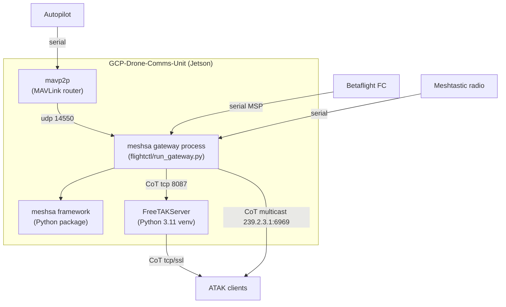
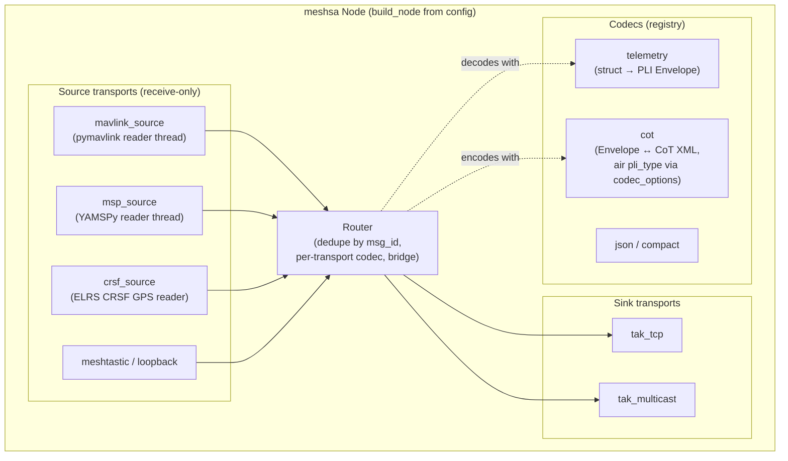
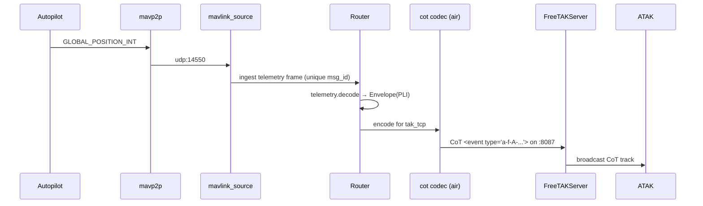

# C4 Architecture — GCP-Drone-Comms-Unit

C4 model (Context → Container → Component) for the drone-comms / mesh-SA → TAK bridge.
Diagrams are Mermaid so they render on GitHub. See [ARCHITECTURE.md](ARCHITECTURE.md) for
the framework's design rationale, [CHARTER.md](CHARTER.md) for the stable scope/invariants,
and [ROADMAP.md](ROADMAP.md) for the long-term milestone trajectory.

## Level 1 — System Context

The unit ingests drone/FC telemetry and mesh SA, and emits **CoT** so ATAK clients see
positions as tracks. ATAK itself runs on phones/tablets, not on the unit.

## Level 2 — Container

Containers are independent processes (systemd units): the **gateway** (meshsa node from a
JSON config), **FreeTAKServer**, and the **mavp2p** MAVLink router. Each scales/fails
independently; the gateway is the only one that must understand both sides.

## Level 3 — Component (inside the meshsa gateway)

Key contracts (Python `Protocol`s, dependency-injected so everything tests without
hardware): `Transport` (start/stop/send/stream bytes), `Codec` (encode/decode `Envelope`),
`Clock`, `IdFactory`. New mediums plug in via `transport_registry` / `codec_registry` with
**no core edits**. The stateful MAVLink/MSP parse lives in each source transport's reader
thread; the `telemetry` codec is a stateless per-frame map. Drone tracks reuse the `PLI`
kind with an **air** `pli_type` configured per-transport — no `schema_version` bump.

**Adjunct services (opt-in, out of the hot path):** the node exposes an optional aiohttp
**health/metrics listener** (`/healthz`, `/metrics` in Prometheus or JSON); the `meshsa.fpv`
ground-side subsystem runs its own CRSF link-health monitor, flight logger, and camera
capture writer; and a **read-only** `meshsa.llm` situational-awareness assistant answers
operator questions over live telemetry (via mavlink2rest on `:8088`) and TAK tracks. These
issue no vehicle commands — see [CHARTER.md](CHARTER.md) §3 and the ratified, M2-gated
supervised-commanding initiative in [ROADMAP.md](ROADMAP.md).

## Data flow (one drone fix)

