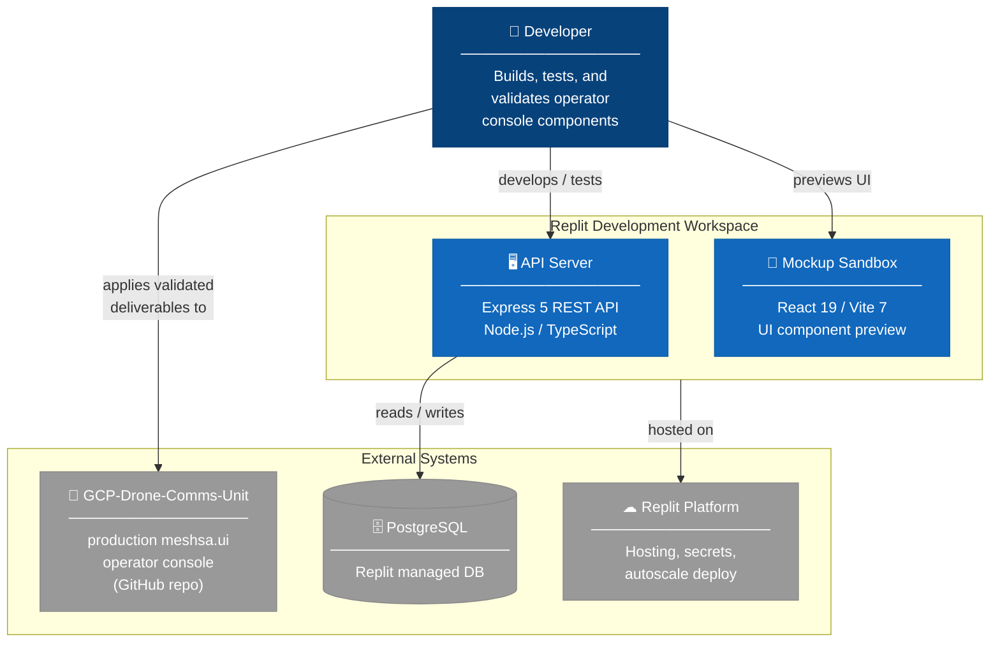
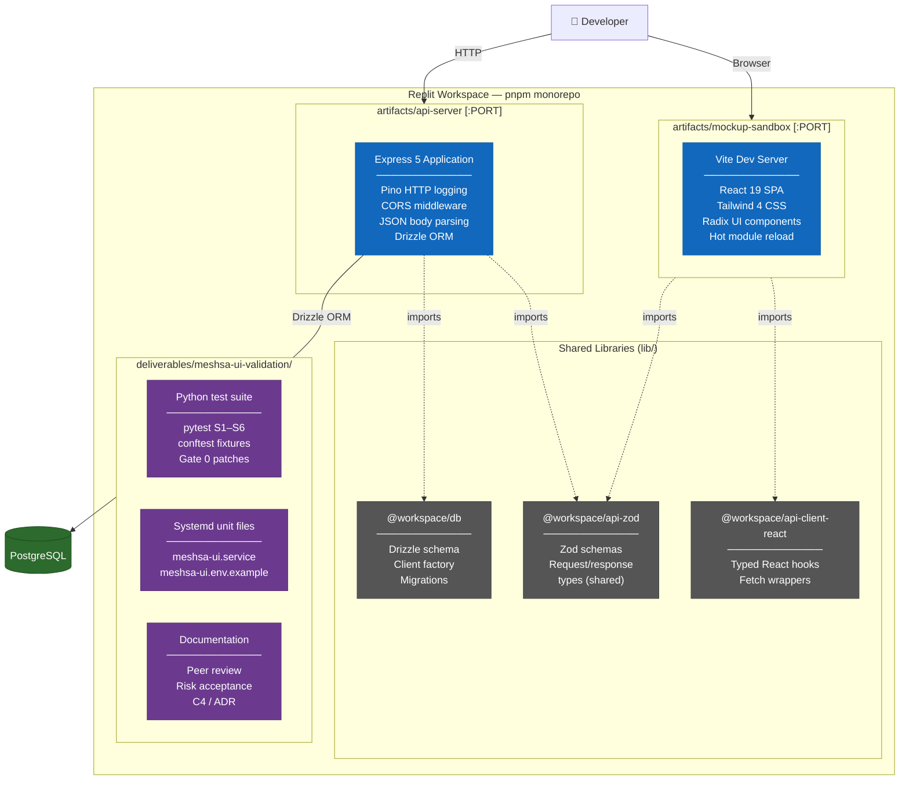
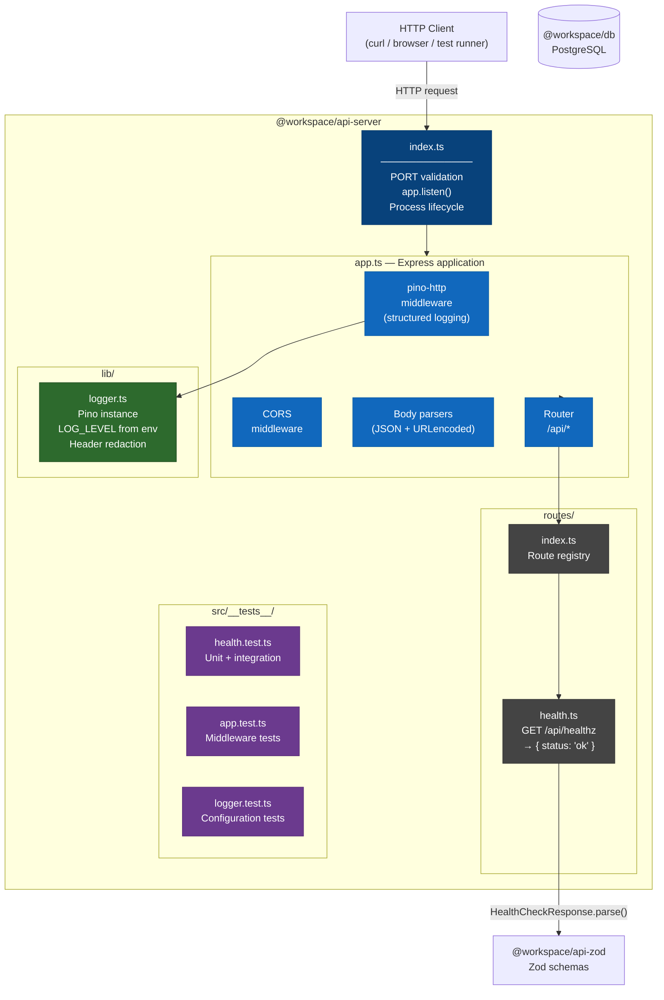
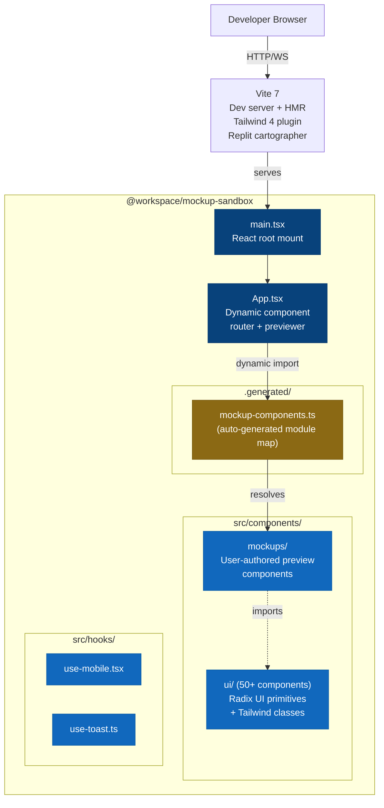
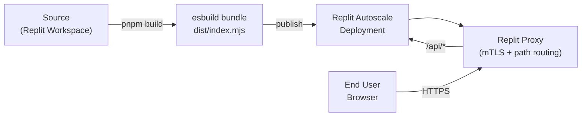

# C4 Architecture — GCP-Drone-Comms-Unit Workspace

Diagrams follow the [C4 model](https://c4model.com/).  All diagrams are rendered
with [Mermaid](https://mermaid.js.org/) (GitHub, VS Code, and most CI platforms
render these natively).

---

## Level 1 — System Context

Who uses the system and what other systems does it interact with.

---

## Level 2 — Container

The containers (deployable/runnable units) inside the workspace.

---

## Level 3 — Component (API Server)

The components inside the `api-server` container.

---

## Level 3 — Component (Mockup Sandbox)

---

## Deployment

---

## Key architectural decisions

See [`docs/adr/`](../adr/) for full Architecture Decision Records.

| Decision | Choice | Rationale |
|---|---|---|
| Package manager | pnpm workspaces | Strict hoisting, catalog pinning, `minimumReleaseAge` security policy |
| Module format | ESM (`"type": "module"`) | Native Node.js ESM; compatible with Vite and Vitest without transforms |
| Bundler | esbuild (api-server) / Vite (sandbox) | Sub-second builds; esbuild for Node.js single-file bundle, Vite for browser HMR |
| Logging | pino + pino-http | Structured JSON; lowest-overhead Node.js logger; header redaction built-in |
| Schema validation | Zod (shared via @workspace/api-zod) | Single source of truth for request/response shapes; TypeScript inference |
| ORM | Drizzle | Type-safe SQL; minimal runtime; schema-first migrations |
| Testing | Vitest | ESM-native; works without transforms; compatible with pnpm workspaces |
| Container runtime | Node.js 24 Alpine | Smallest footprint; LTS; ESM built-in support |
