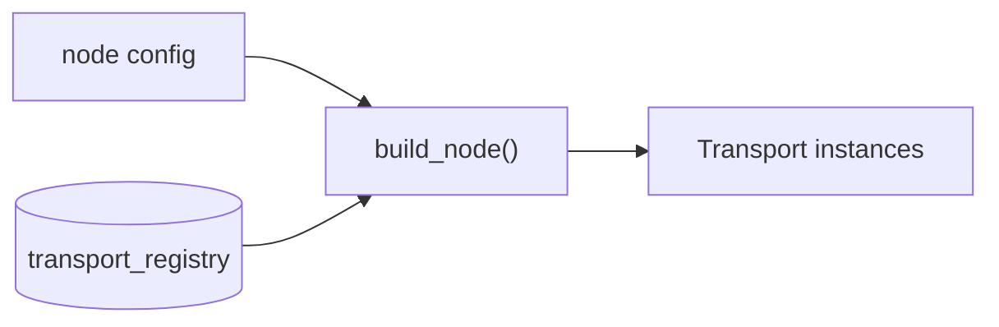

# Design — Per-Directory `AGENTS.md` Guides

## D-0. Standards baseline (researched 2026-09-19)

The request was to meet today's standards, so the standards were checked
rather than assumed. Findings, and what each one forces in this design:

| Finding | Source | Consequence here |
| ------- | ------ | ---------------- |
| `AGENTS.md` (plural) is the open format: formalized August 2025, donated to the Linux Foundation's Agentic AI Foundation in December 2025, used by 60k+ repositories, read by Codex, Cursor, Copilot coding agent, Aider, Jules, Gemini CLI, Devin, Windsurf, Amp, Zed, Warp, Factory | [agents.md project](https://github.com/agentsmd/agents.md), [Tembo](https://www.tembo.io/blog/agents-md), [ASDLC](https://asdlc.io/practices/agents-md-spec/) | **D-1**: the filename is `AGENTS.md`, not `Agent.md` |
| The format has **no required fields** — plain Markdown, any headings; agents just read the text | [agents.md project](https://github.com/agentsmd/agents.md) | The section contract in **D-3** is a *house* convention we enforce ourselves; nothing external validates it, so `validate_agents_docs.py` must |
| Nested files resolve nearest-first, like `.gitignore`/`.eslintrc`; root states what is true everywhere, leaves state only what differs. OpenAI's own Codex repo ships 88 of them | [dev.to](https://dev.to/promptmaster/agentsmd-in-a-monorepo-nested-files-and-precedence-1b7d), [Codex KB](https://codex.danielvaughan.com/2026/03/26/agents-md-advanced-patterns/) | **D-2**'s tiering, and **D-3**'s no-duplication rule |
| Deploy-risk and ownership rules should be *additive*, not overridable by a leaf file | [dev.to](https://dev.to/promptmaster/agentsmd-in-a-monorepo-nested-files-and-precedence-1b7d) | **D-3**: a scoped guide may add a hazard, never relax a root rule. The checker rejects a scoped file that negates a root rule |
| Machine-generated `AGENTS.md` files **reduced** task success in 5 of 8 tested settings and added 2.45–3.92 steps per task; every token loads on every request | [SitePoint](https://www.sitepoint.com/agents-md-optimization-cut-token-waste-linting/), [daily.dev](https://daily.dev/posts/agents-md-optimization-context-linting-for-coding-agents-mb705ug5n) | **D-2** (tiering, not blanket coverage) and **D-4** (per-tier line budgets, enforced) |
| Practical size guidance: 30–50 lines to start, 200–500 lines as the outer bound, ≤5% of context | [betterclaw](https://www.betterclaw.io/blog/agents-md-best-practices), [BuildBetter](https://blog.buildbetter.ai/agents-md-complete-guide-for-engineering-teams-in-2026/) | **D-4** budgets: 12/60/80/150 lines by tier — tighter than the public guidance, matching the repo's own 25–67-line scoped files |
| Anthropic's own guidance: target **under 200 lines**; write instructions concrete enough to verify ("Use 2-space indentation", not "Format code properly") | [Claude Code memory docs](https://code.claude.com/docs/en/memory) | **D-3**'s `## Rules` must be imperative and verifiable; **D-7** check 10 rejects unverifiable filler |
| Linting `AGENTS.md` for stale paths, dead scripts and context rot is an established practice (`agents-lint` checks path existence, script existence, TODO markers, file length) | [agents-lint](https://github.com/giacomo/agents-lint) | **D-7**: the checker's highest-value rules are cited-path existence and command existence |
| Mermaid renders natively in GitHub Markdown files, issues, PRs and wikis | [GitHub Docs](https://docs.github.com/en/get-started/writing-on-github/working-with-advanced-formatting/creating-diagrams) | **D-5**: fenced ```mermaid, consistent with `docs/C4.md` |
| Mermaid conveys **nothing** about node relationships to screen readers; every chart needs an accessible name plus a text description, and complex diagrams should be split | [Mermaid accessibility](http://mermaid.js.org/config/accessibility.html), [PUL](https://pulibrary.github.io/2023-03-29-accessible-mermaid) | **D-5**: `accTitle:` + `accDescr:` + a prose summary are mandatory and checked; ≤15 nodes |
| Claude Code subagents: `.claude/agents/*.md`, `name` + `description` required, `tools`/`model` optional; descriptions drive automatic delegation and must stay short | [Claude Code sub-agents docs](https://code.claude.com/docs/en/sub-agents) | **D-8**: `docs-cartographer` matches the existing roster shape, which `validate_workforce.py` already enforces |
| Claude Code reads `AGENTS.md` only when no `CLAUDE.md` exists at or above the working directory; a `CLAUDE.md` that imports `AGENTS.md` gets both | [Claude Code memory docs](https://code.claude.com/docs/en/memory) | **D-6** — the finding that changes the most about this plan |

Two published claims were checked and **rejected** for this repo:

- *"Put an `AGENTS.md` in every directory."* Contradicted by the measured
  task-success regression above. Coverage is not the goal; distinct content
  is. See **D-2**.
- *"Claude Code reads `AGENTS.md` as a fallback, so a pointer is enough."*
  False here: a root `CLAUDE.md` suppresses the fallback entirely. See **D-6**.

## D-1. The filename is `AGENTS.md`

The request said `Agent.md`. Nothing reads that name — not Claude Code, not
Codex, not Cursor, not Copilot. `AGENTS.md` is the format with tool support
and an ecosystem, it is what this repo's four existing scoped guides already
use, and it is what the root `AGENTS.md` and `docs/specs/README.md` tell
agents to look for. Using any other spelling would create a documentation tree
that only humans can find.

**Decision**: `AGENTS.md`, plural, uppercase, in every tier.

## D-2. Tiered coverage, not one file per directory

114 directories carry tracked files. Blanket coverage is rejected on the
measured evidence in D-0. A directory earns a guide only when it has a
**distinct contract** — at least one of:

- its own build/test/run command that differs from its parent's, **or**
- an invariant or hazard an agent can violate that the parent file does not
  state, **or**
- a boundary (generated code, frozen path, deployment manifest, read-only
  archive) that is invisible from the file contents alone.

A directory that satisfies none of these is covered by the nearest ancestor
and gets nothing. This yields four tiers:

| Tier | What | Count | Budget | Mermaid |
| ---- | ---- | ----- | ------ | ------- |
| 0 | Repository root | 1 | ≤150 lines | Required (repo map) |
| 1 | Domain roots — a build target, a language boundary, or a deployment unit | 13 | ≤80 lines | Required (folder boundary) |
| 2 | Subsystems with their own contract inside a domain | 16 | ≤60 lines | Only where a flow is non-obvious |
| 3 | Guard files — generated, vendored, or read-only directories | 6 | ≤12 lines | Forbidden |

Tier is depth of contract, not depth in the tree: `scripts/` is top-level but
Tier 2, because its contract is narrow even though its position is not.

The exhaustive per-directory list, with the reason each one qualifies, is
`tasks.md`. Directories deliberately left uncovered are listed there too, so
"missing" is distinguishable from "decided against".

**Open call (proposal §1)**: `src/meshsa/cv/` and `src/meshsa/llm/` sit at the
margin — each has a real invariant (`cv/` must stay dependency-free because a
heavy detector process imports it; `llm/`'s entire tool surface must stay
read-only), but each is small enough that `packages/meshsa/AGENTS.md` could
carry it. They are included in Tier 2 as proposed; dropping them is a one-line
manifest edit. `src/meshsa/examples/` was considered and cut — it is a
one-file re-export shim with no contract of its own.

## D-3. The authoring contract

Fixed H2 order, so a reader and a checker both know where to look:

```markdown
# <Name> Agent Guide
> Scope: `<repo-relative path>` · Parent: [<../AGENTS.md>](../AGENTS.md)

## Purpose        2–3 sentences. What this folder is FOR, in domain terms.
## Map            Mermaid. Tier 0/1 required, Tier 2 optional, Tier 3 forbidden.
## Key files      Table: file → one-clause role. Only the files that matter.
## Rules          Imperative, verifiable, and true ONLY here.
## Commands       Literal shell commands that work from this folder.
## Subagents      Which roster agent / skill / custom mode owns work here.
## Verification   What must be green before a PR touching this folder.
```

Tier 3 guard files carry `# <Name>`, the breadcrumb, `## Purpose`, and
`## Rules` only.

Four rules govern content, and each maps to a check in D-7:

1. **No repeats.** A rule true repo-wide lives in the root file and nowhere
   else. The checker flags a scoped line that is a near-duplicate of a root
   line. This is the single biggest defence against the token-waste regression
   in D-0.
2. **Additive, never subtractive.** A scoped guide may add a constraint. It
   may never relax one the root sets — no "the root says X, but here you can
   skip it". Security and ownership rules in particular are additive by
   design.
3. **Verifiable or cut.** "Keep operational defaults in Pydantic config
   models, not in transport logic" is verifiable. "Follow best practices" is
   the exact filler the D-0 research measured as harmful.
4. **Cite, don't inline.** Workflows live in `.agents/skills/`, architecture
   in `docs/C4.md`, specs in `docs/specs/`. A guide links; it never copies.

The contract ships as `.agents/skills/agents-md-authoring/SKILL.md` — the
repo's established home for a repeatable workflow, and already linted by
`tools/validate_skills.py` (frontmatter `name`/`description`/`argument-hint`,
`Use when:` description prefix, cited-path existence).

## D-4. Line budgets

Public guidance runs 30–50 lines minimum to 200–500 lines maximum; Anthropic's
own is "under 200". The repo's existing scoped guides run 25–67 lines and the
root runs 135. The budgets in D-2's table are set from the repo's own practice
rather than the looser public ceiling, because the failure mode being
defended against is accretion — "multiple contributors append instructions
without reviewing what already exists".

Budgets are enforced (D-7 check 3), exactly as `validate_workforce.py` already
enforces `MAX_LINES = 60` on roster entries. A guide that needs more room is a
guide that should be citing a spec instead.

## D-5. Mermaid policy

Diagrams earn their place by showing the folder's **boundary** — what enters,
what leaves, and where the seam is — not by re-drawing the system. `docs/C4.md`
owns Context/Container/Component; a guide that needs that level links to it.

Mandatory for every block:



- `accTitle:` — the accessible name. Without it a screen reader gets an
  unlabelled graphic.
- `accDescr:` — the relationships, in prose. Mermaid exposes none of the edge
  semantics to assistive technology on its own.
- A one-sentence prose summary **immediately after** the fence, for readers
  with images off and for any agent that does not render the diagram. This
  doubles as the answer to "what was this diagram supposed to say" when the
  diagram drifts.
- **≤15 nodes**, one concept per diagram. Split rather than grow; complex
  diagrams render slowly and read badly on narrow screens.
- `flowchart LR`/`TB` for data and control flow; `sequenceDiagram` only when
  ordering is the point; no `C4Context` — that would fork `docs/C4.md`.

Cost check: a 12-node flowchart with accessibility lines runs ~150–250 tokens,
which fits inside the Tier 1 budget with room for the rest of the file.

## D-6. Making Claude Code actually load the tree

This is the finding that changes the plan, and it is worth stating precisely
because the common advice is wrong for this repo.

**Current state.** Claude Code's default instruction mode is
`claude-md-or-agents-md`: it reads `AGENTS.md` files *only when no `CLAUDE.md`,
`.claude/CLAUDE.md`, or `CLAUDE.local.md` exists in the working directory or
above it*. This repo has a root `CLAUDE.md`. Therefore **no `AGENTS.md` in this
repository is loaded by Claude Code today** — not the root one, not the four
scoped ones. The root `CLAUDE.md`'s `Read [AGENTS.md](AGENTS.md) first` is a
markdown link in prose, not an `@` import, so it is an instruction the model
may act on, not a file the harness loads.

**Fix, in two parts.**

1. **Root.** Change the root `CLAUDE.md`'s pointer to a real `@AGENTS.md`
   import. Imports are expanded into context at launch, so the canonical guide
   loads mechanically. The prose "then read the nearest scoped `AGENTS.md`"
   line stays, because it still steers tools that are not Claude Code.
2. **Nested.** Each directory that gains an `AGENTS.md` also gains a
   three-line `CLAUDE.md`:

   ```markdown
   # Claude Code pointer
   @AGENTS.md
   ```

   Nested `CLAUDE.md` files are *not* loaded at launch — they load on demand
   when Claude reads a file in that subtree. Relative imports resolve against
   the file containing the import, so `@AGENTS.md` means "the sibling". Net
   session-start cost: zero. Net guarantee: the guide is in context whenever
   an agent touches that folder, without depending on the model choosing to go
   looking.

**Alternatives considered and rejected.**

- *Symlink `CLAUDE.md` → `AGENTS.md`.* Rejected. This repo explicitly supports
  Windows contributors (`CLAUDE.md` mandates PowerShell syntax), and Git
  symlinks on Windows require Developer Mode or elevation and degrade to plain
  text files under `core.symlinks=false`. A three-line regular file works
  everywhere.
- *Set `pluginConfigs["agents-md@builtin"].options.instructionFiles` to
  `claude-md-and-agents-md`.* Rejected as the primary mechanism: Claude Code
  **ignores that key in project and local settings files**; it is honoured only
  from user or managed settings. It therefore cannot be committed on behalf of
  the team. It is worth documenting in `CONTRIBUTING.md` as an optional
  per-developer setting, and it is the reason the stub files must not be
  load-bearing for content — only for loading.
- *Move the content into `.claude/rules/` with `paths:` frontmatter.*
  Rejected. Claude-native and lazily loaded, but it would split the content
  from the `AGENTS.md` tree that every other tool reads, recreating exactly the
  drift these validators exist to prevent.

**Note.** Claude Code never reads anything under a `.agents/` directory as
project instructions. `.agents/skills/` therefore stays correctly scoped as
skills, and the authoring contract in D-3 is reached by citation, not by
ambient loading.

## D-7. `tools/validate_agents_docs.py`

The third sibling of `validate_workforce.py` and `validate_skills.py`, and
deliberately identical in construction: standalone, stdlib-only, policy as
module constants, one finding per line on stdout, exit 1 on any finding.
Reuses the `_TOKEN_STRIP` / `CHECKABLE_PATH_PREFIXES` path-citation logic that
`validate_skills.py` already proved out.

| # | Check | Catches |
| - | ----- | ------- |
| 1 | Manifest ↔ filesystem agree in both directions | A guide added without a tier decision; a planned guide silently never written |
| 2 | Required H2 sections present, in canonical order, for the file's tier | Drift back to freeform files |
| 3 | Line count within the tier budget | Accretion — the measured failure mode |
| 4 | Breadcrumb present; its parent link resolves | Orphaned guides after a folder move |
| 5 | Every cited repo-relative path exists | Stale paths — the top-ranked staleness failure in the lint literature |
| 6 | Every ```mermaid block has `accTitle:`, `accDescr:`, ≤15 node lines, and a prose line after the fence | Inaccessible and unexplained diagrams |
| 7 | Every `## Subagents` entry names a real `.claude/agents/*.md`, `.agents/skills/*/SKILL.md`, or `.github/agents/*.agent.md` | Delegation pointing at agents that do not exist |
| 8 | Every `make`/`pnpm run`/`npm run` command in `## Commands` names a real target or script | Dead commands — an agent running them wastes a full turn |
| 9 | A paired `CLAUDE.md` exists and imports `@AGENTS.md` | The D-6 bridge silently missing for one folder |
| 10 | No `## Rules` line is a near-duplicate of a root `AGENTS.md` rule | The repeats that D-3.1 forbids |

Wired into `tools/Makefile`'s `checkers` target, `scripts/validate-pre-pr.sh`,
CI's `governance` job, and `.pre-commit-config.yaml`. Tested in
`tools/tests/test_validate_agents_docs.py`, matching how this repo already
tests its checkers.

**Deliberate non-goal**: the checker validates *structure and references*, not
prose quality. Whether a rule is worth stating is a review judgement, which is
what D-8 puts an owner behind.

## D-8. Subagents — two distinct things

The request named subagents, and there are two separate needs behind it.

**(a) Delegation discoverable from the folder.** Every guide carries a
`## Subagents` section naming the *existing* roster agents, skills, and custom
modes that apply there. Example, for `packages/meshsa/src/meshsa/transports/`:

```markdown
## Subagents
- `security-reviewer` (`.claude/agents/security-reviewer.md`) — mandatory before any PR touching this folder.
- `bind-auditor` (`.claude/agents/bind-auditor.md`) — any diff adding, moving, or removing a socket bind.
- Skill: [meshsa-add-transport](../../../../../.agents/skills/meshsa-add-transport/SKILL.md).
```

This section invents nothing. Check 7 rejects a name that does not resolve,
which is the same discipline `validate_workforce.py`'s `Relationship:` marker
already imposes in the other direction. The root `AGENTS.md`'s binding rule —
`security-reviewer` reviews every diff touching `packages/` or any transport
before a PR — is restated at each folder it actually governs, which is
additive per D-3.2, not a new rule.

**(b) One new roster agent: `docs-cartographer`.** A guide tree with no owner
becomes stale documentation, which is worse than none — an agent that trusts a
wrong path burns a turn. The roster gains exactly one entry:

```yaml
---
name: docs-cartographer
description: "Authors and refreshes the per-directory AGENTS.md guides and their Mermaid maps. Invoke on any diff that adds, removes, or relocates a module in a covered folder, and whenever validate_agents_docs reports a finding."
tools: Read, Grep, Glob, Write, Edit, Bash(rg *), Bash(python tools/validate_agents_docs.py*)
---
```

Body carries the `Relationship:` marker `validate_workforce.py` requires,
pointing at `.agents/skills/agents-md-authoring/SKILL.md`, and stays within the
60-line cap. Tools are write-scoped to documentation work; it holds no test,
build, or git authority.

**Exactly one new agent, deliberately.** The roster is small on purpose and
every entry costs description tokens at every session start. The remaining
need — "this folder's guide is now wrong because the folder changed" — is a
trigger for the one new agent, not a reason for seven more.

## D-9. Rollout order

Sequenced so CI is never knowingly red between phases, and so the checker
exists before the content it governs. Full task breakdown in `tasks.md`.

1. **Contract and enforcement first.** Skill, roster agent, checker, and tests
   land with a manifest listing **only the five guides that already exist**.
   Those five are retrofitted to the D-3 contract in the same phase. CI green.
2. **Root and bridge.** Root `AGENTS.md` gains its repo-map diagram and
   delegation table; root `CLAUDE.md` gains the `@AGENTS.md` import.
3. **Tier 1**, one commit per domain, manifest extended per commit.
4. **Tier 2**, same discipline.
5. **Tier 3 guard files**, plus the nested `CLAUDE.md` stubs for everything
   added in phases 3–5.
6. **Gate wiring**: pre-commit, `validate-pre-pr.sh`, CI `governance` job,
   `CONTRIBUTING.md`, `CHANGELOG.md`.

Phase 1 is the stop point for review. If the contract is wrong, it is wrong on
5 files, not 28.

## D-10. The frozen path cannot hold its own guide

`.claude/governance.yaml` freezes `packages/meshsa/src/meshsa/command/**` while
`c_gate_met` is `false`, and `governance.py::match_globs` uses
`fnmatch.fnmatchcase`, whose `*` crosses `/`. Verified against the real
matcher's semantics:

```
packages/meshsa/src/meshsa/command/AGENTS.md  -> packages/meshsa/src/meshsa/command/**
packages/meshsa/src/meshsa/command/CLAUDE.md  -> packages/meshsa/src/meshsa/command/**
packages/meshsa/src/meshsa/AGENTS.md          -> None
```

So the scope-freeze `PreToolUse` hook denies a Write/Edit to a *documentation*
file in the frozen directory, not just to code. This is correct behaviour, not
a bug to work around: the freeze is path-shaped by design, and a carve-out for
`*.md` would be a hole someone eventually drives a module through.

**Resolution**: the frozen path's guidance lives in its parent,
`packages/meshsa/src/meshsa/AGENTS.md`, under a `### command/ (frozen)`
subsection — which is also where an agent about to touch `command/` is most
likely to be reading. `MESHSA_GOVERNANCE_OVERRIDE` is **not** used to place a
documentation file inside a frozen path; every override is logged, and spending
one on a Markdown file would train exactly the wrong reflex. The same applies
to `scope_widening_globs` (`federation/**`, `storeforward/**`), which do not
exist yet and therefore need no guide at all.

## D-11. Keeping it true

Three mechanisms, in increasing order of strength:

- **Checker** (D-7) — catches structural and reference rot on every PR. Strong,
  but blind to prose that is merely out of date.
- **Owner** (D-8b) — `docs-cartographer` is triggered by module-level changes
  in a covered folder.
- **Budget** (D-4) — a file that cannot grow must be edited rather than
  appended to, which forces the review that the D-0 accretion research says
  never happens on its own.

`CONTRIBUTING.md` gains one line in its PR checklist: *if a PR adds, removes,
or moves a module in a folder with an `AGENTS.md`, refresh that file's
`## Key files` table in the same PR.*
