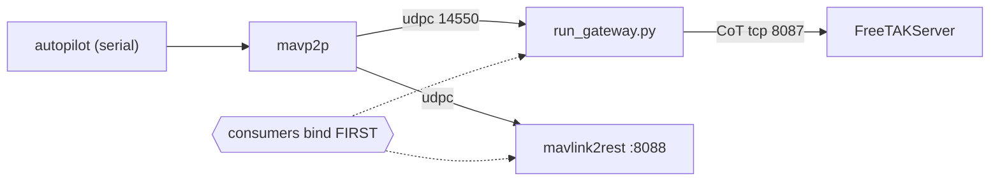

# FlightCtl Agent Guide

> Scope: `flightctl` · Parent: [../AGENTS.md](../AGENTS.md)

## Purpose

Deployment and runtime assets that turn a Jetson Orin Nano into a MAVLink→CoT/TAK
gateway: node configs, systemd units, bring-up scripts, udev rules, and a simulator.
The framework itself lives in `packages/meshsa`; this folder only wires and runs it.

## Traps

- **Start order is load-bearing.** mavp2p's `udpc` outputs are *connected* sockets, so
  every consumer must bind before mavp2p starts. `scripts/start_all.sh` encodes the
  order; starting services by hand in a different order produces a silent no-traffic
  state, not an error.
- **The simulator needs `MAVLINK20=1`.** Without it `sim/mavlink_fake.py` emits v1
  frames and the gateway drops them without a useful message.
- **`sim/mavlink_fake.py` carries a `literal_guard` `endpoints` waiver.** Substituting
  `DEFAULT_MAVLINK_ENDPOINT` for its literal silently flips the socket from send to
  listen. Read the waiver rationale in `.claude/governance.yaml` before touching it.
- **`mypy flightctl/ tools/` must stay one invocation.** Splitting it makes pytest's flat
  collection see colliding `tests`/`conftest` module names. CI runs it as one step.
- **Only `*.env.example` and `*.rules.example` are tracked.** A real `llm.env` or
  `base.env` in a commit is a secret leak, not a convenience.
- **`run_commander.py` is write-denied.** It is in `command_emission_globs` and the
  scope-freeze hook refuses edits while `governance.c_gate_met` is `false`.

## Rules

- Keep `run_gateway.py` dependency-free beyond `meshsa` — why: it runs under systemd on a
  device with no dev extras installed, so an import it cannot satisfy is a boot failure.
- Route any new listener through `meshsa.netauth.validate_bind` — why: `flightctl/**/*.py`
  is inside `bind_guard`'s scan globs and an unguarded bind fails CI. — control: bind_guard
- Leave `M2R_BIND` defaulted to `127.0.0.1` — why: mavlink2rest is an unauthenticated
  MAVLink surface, so a `0.0.0.0` bind is a command-injection path onto the airframe.
  — control: advisory (shell default, not linted)
- Do not edit `run_commander.py` or anything under it — why: the M2 gate is unmet and the
  freeze is the mechanism, not a suggestion. — control: scope_freeze
- Keep shell POSIX-compatible and idempotent — why: these scripts are re-run on a live
  node during bring-up, and CI lints every tracked `*.sh`. — control: ci:shell
- Pin new Python deps in `constraints/` rather than inline — why: the FTS venv is built
  against verified pins and an unpinned transitive break is only visible on the device.

## Commands

```bash
ruff check flightctl && ruff format --check flightctl
mypy flightctl/ tools/ --exclude archive     # one invocation, not two
bash -n flightctl/scripts/*.sh && shellcheck -x --severity=warning flightctl/scripts/*.sh
bash flightctl/scripts/start_all.sh status
```

## Subagents

- `charter-gate-keeper` — any diff touching `run_commander.py` or attempting to enable
  commanding; it exists to surface the M2 gate for a human.
- `bind-auditor` — any diff that adds, moves, or removes a socket bind here.
- `config-guardian` — before adding a port, host, or interval literal to a config or
  script; the repo's literal policy is enforced, not aspirational.
- `security-reviewer` — mandatory before any PR touching this folder.
- `ops-deploy-base-node` — the skill for deployment and runbook changes; read it before
  editing a systemd unit, because unit changes and the install guide move together.

## Map



Consumers must be listening before mavp2p starts; the dotted edges mark the ordering
constraint that `scripts/start_all.sh` exists to enforce.
