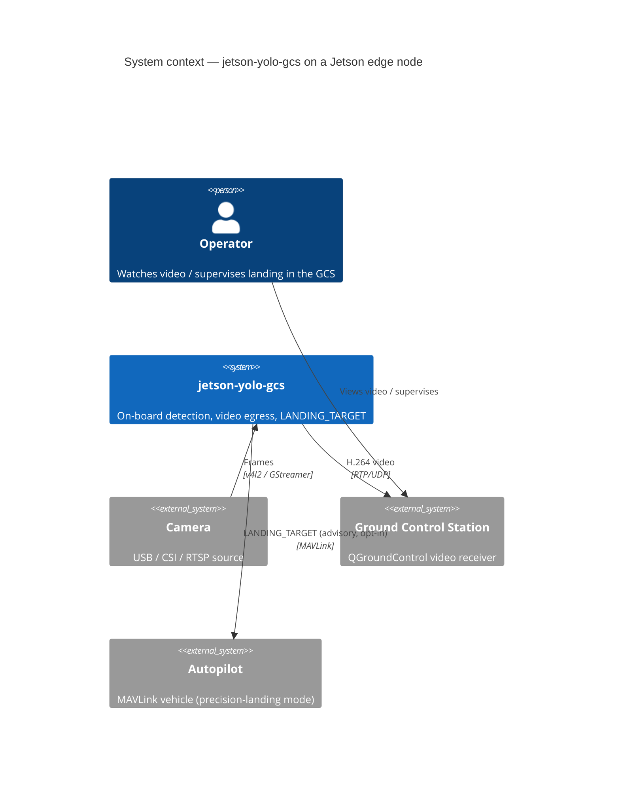
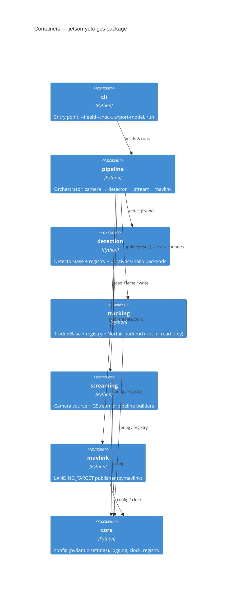
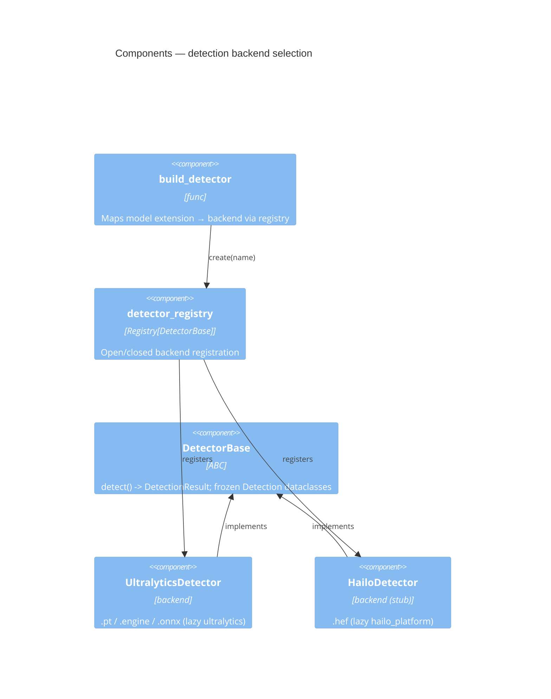
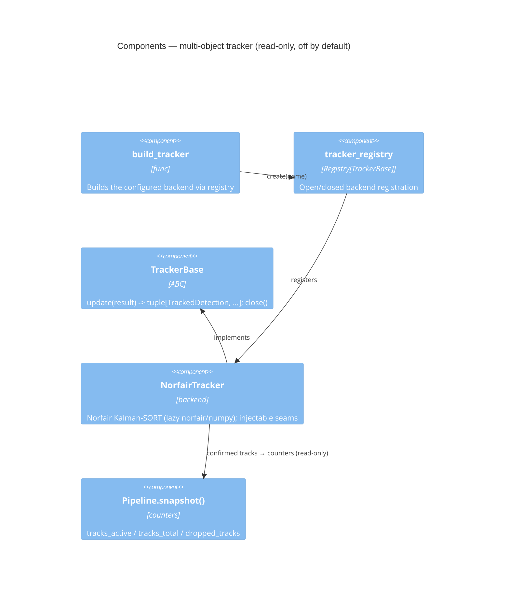

# jetson-yolo-gcs — C4 architecture

C4 model (Context → Container → Component) for the on-board perception package. Mirrors
the diagram style of the repo-level [`docs/C4.md`](../../../../docs/C4.md).

## Level 1 — System context

## Level 2 — Containers

## Level 3 — Components (detection)

## Level 3 — Components (tracking, opt-in)

## Level 4 — Code / key seams

- **Dependency-injection seams (Protocols):** `core.clock.Clock`,
  `streaming.camera.CameraSource`, `streaming.gstreamer.StreamWriter`, plus the injectable
  pymavlink connection on `mavlink.bridge.LandingTargetBridge`. Unit tests substitute fakes;
  the real OpenCV/ultralytics/pymavlink construction is the only `# pragma: no cover`.
- **Pure, testable builders:** `streaming.camera.build_capture_pipeline`,
  `streaming.gstreamer.build_stream_pipeline`, `mavlink.bridge.compute_angles`,
  `utils.fps.FpsCounter`, `utils.jetson.parse_tegrastats`, and `cli.health_report`.
- **Config:** `core.config.Settings` composes `YoloSettings` / `CameraSettings` /
  `StreamSettings` / `MavlinkSettings` / `TrackerSettings`, each a `pydantic-settings`
  `BaseSettings` with its own env prefix. `MavlinkSettings.enable_landing_target` and
  `TrackerSettings.enabled` both default to **false**.
- **Tracker seam (read-only, advisory):** `tracking.base.TrackerBase` (ABC) +
  `tracking.factory.tracker_registry` mirror the detector seam; `NorfairTracker` isolates the real
  `norfair`/`numpy` construction behind two injectable seams (`tracker`, `to_detections`) so the id
  map-back is fake-tested with no heavy import (removing the need for `# pragma: no cover`). The
  tracker never feeds `_select_target`/the bridge; `Pipeline` counts distinct tracks with an O(1)
  monotonic high-water mark.
